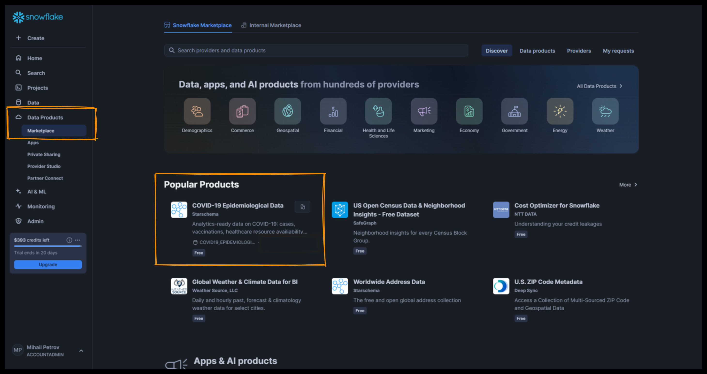

# Казус 3 - Имунна система

### 📌 Бизнес информация и анализ

Клиент от мединицнската индустрия се свързва с нас, с молба да му помогнем да разбере идеята на огромна информационна система, свързана със случай на COVID19 - плана му е да разработи информационна система, която да се възползва от събраната информация за целите на неговия собствен бизнес

### 💡 Изисквания към заданието

Свалете информационната система за случай свързани с COVID 19 от офицялния маркет на Snowflake.

Подгответе документ описващ идеята на всяка една от таблиците, каква информация се съдржа в ния и какво е отношението и към другите таблици. Измислете поне 3 use case - а (наблюдения), които можем да направим от информацията в таблиците.

### 🚀 Предаване на заданието
Създейте ново, Github репозитори, **use-case-2-medical-data**. В нея създайте една единствена папка, в която да направите единствен MARKDOWN файл README - съдържаш: 
- описанието на таблиците
- за какво могат да ни бъдат полезни
- 3 варианта, за използването им в информационна система

### 📅 Време за работа по заданието
Това задание е изцело ориентирано към извличане на инфорвация от бизнес система. Срока за предаване на заданието е 18 Март до следобяд.